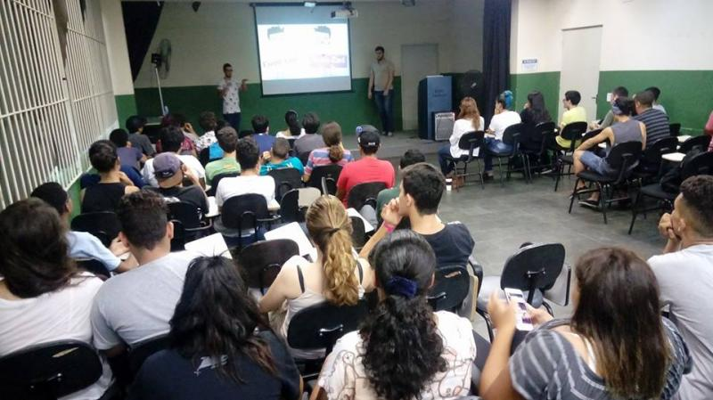
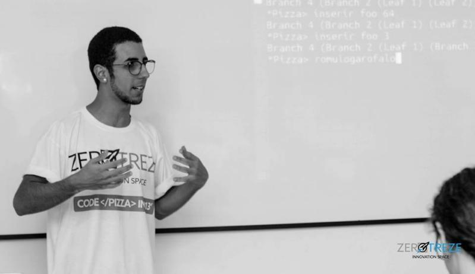

# I graduated, and then?

In this talk,I mainly talk about which qualifications and skills you will achieve after you graduate, and also about job opportunities.

----------------------------------------------------------------------------------

# Introduction to functional programming with Haskell

This was my first Talk about Haskell Language, as an introduction about functional paradigm and Haskell language.

